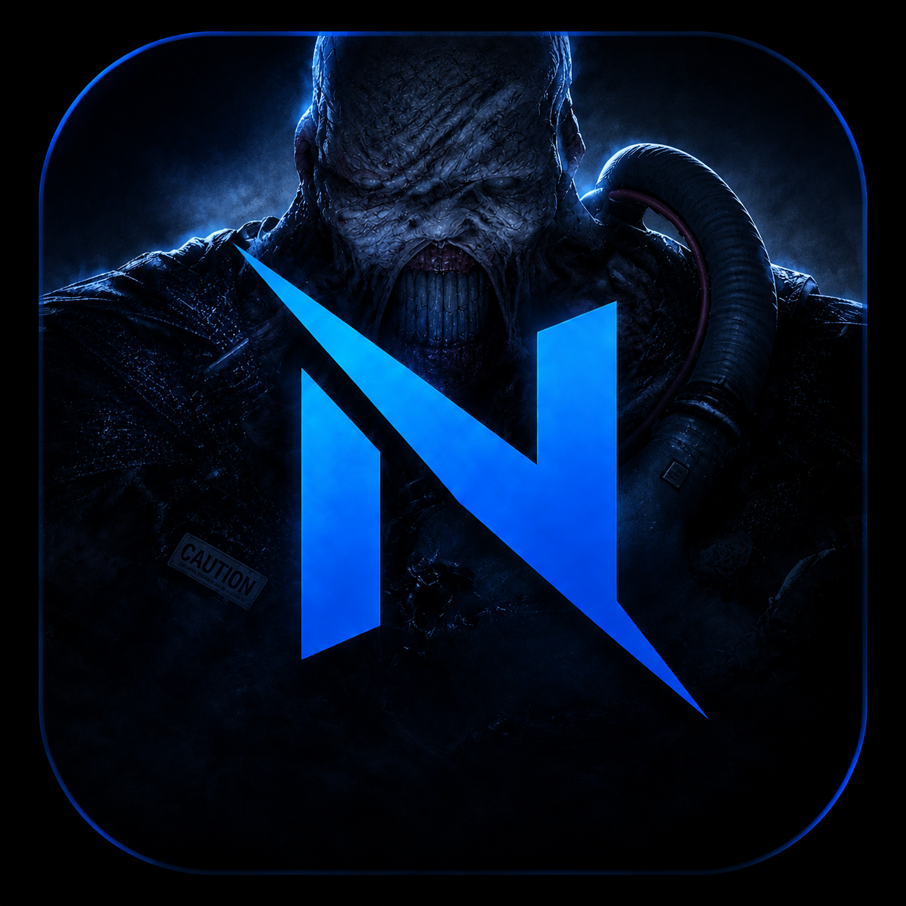

# ⚔️ Project Nemesis

<p align="center">
  
</p>

<h1 align="center">Project Nemesis</h1>

<p align="center">
  <strong>چارچوب تست نفوذ و ارزیابی امنیت سرویس‌های ویندوز</strong>
</p>

<p align="center">
  یک پلتفرم ماژولار خط فرمان برای شناسایی شبکه، تحلیل پروتکل‌ها،<br>
  ارزیابی امنیتی و تحقیقات امنیت سایبری
</p>

<p align="center">
  <a href="README.md">🇬🇧 English</a>
</p>

---

## ⚡ معرفی

**Project Nemesis** یک چارچوب ماژولار برای یکپارچه‌سازی مجموعه‌ای از ابزارهای امنیتی، تست نفوذ و تحقیقات مرتبط با **سرویس‌ها و پروتکل‌های ویندوز و شبکه** است.

هدف Nemesis این است که به‌جای مدیریت جداگانه ابزارهای مختلف، یک رابط خط فرمان یکپارچه در اختیار کاربر قرار دهد تا بتواند ماژول‌های مختلف را:

* شناسایی کند
* نصب و دریافت کند
* اجرا کند
* به‌روزرسانی کند
* و مدیریت کند

هر ابزار در قالب یک پروژه مستقل توسعه داده می‌شود و چارچوب اصلی Nemesis نقش **مدیریت، هماهنگ‌سازی و اجرای ماژول‌ها** را بر عهده دارد.

> ⚠️ **Project Nemesis تنها برای تست‌های مجاز، تحقیقات امنیتی، آموزش و محیط‌های آزمایشگاهی ایزوله طراحی شده است.**

---

# 🧠 فلسفه طراحی

Nemesis بر پایه یک ایده ساده طراحی شده است:

> **یک چارچوب، چندین ابزار امنیتی، یک گردش‌کار یکپارچه**

هر ابزار به‌صورت یک ماژول مستقل نگهداری می‌شود و repository، وابستگی‌ها و قابلیت‌های خاص خود را دارد.

این معماری باعث می‌شود:

* توسعه ابزارهای جدید ساده‌تر باشد
* ماژول‌ها مستقل از یکدیگر توسعه پیدا کنند
* بروزرسانی هر ابزار بدون تغییر کل پروژه انجام شود
* مدیریت وابستگی‌ها ساده‌تر شود
* ابزارها در محیط‌های آزمایشگاهی جداگانه بررسی شوند
* اضافه کردن قابلیت‌های جدید به Framework راحت‌تر باشد

---

# ✨ قابلیت‌ها

### 🖥️ داشبورد تعاملی

یک رابط کاربری ترمینالی برای دسترسی به تمام ماژول‌های Nemesis از یک نقطه.

### 🧩 معماری ماژولار

هر ابزار امنیتی به‌عنوان یک پروژه مستقل نگهداری می‌شود و توسط Framework مدیریت می‌شود.

### 📦 دریافت خودکار ماژول‌ها

در صورت نبودن یک ماژول، Nemesis repository مربوط به آن را به‌صورت خودکار دریافت می‌کند.

### 🔄 بروزرسانی ماژول‌ها

ماژول‌های موجود را می‌توان از طریق Launcher مجدداً دریافت و بروزرسانی کرد.

### 🚀 اجرای سراسری

امکان نصب یک دستور سراسری با نام:

```bash
nemesis
```

و اجرای Framework از هر مسیر.

### 🐍 یکپارچه‌سازی ابزارهای Python

هر ماژول می‌تواند وابستگی‌ها و محیط اجرای Python مخصوص خود را داشته باشد.

### 🎓 تمرکز بر آموزش و تحقیق

Nemesis برای استفاده در حوزه‌های زیر طراحی شده است:

* آزمایشگاه‌های تست نفوذ
* تحقیقات امنیتی
* آموزش Red Team
* آموزش امنیت شبکه
* ارزیابی زیرساخت‌های ویندوز
* تحقیقات امنیت پروتکل‌ها

---

# 🧩 ماژول‌ها

در حال حاضر Project Nemesis شامل ماژول‌های زیر است:

| ماژول                   | Repository                                                                  | کاربرد                                         |
| ----------------------- | --------------------------------------------------------------------------- | ---------------------------------------------- |
| 🔎 **Nemesis Scanner**  | [`Nemesis-Scanner`](https://github.com/ErfanNahidi/Nemesis-Scanner)         | شناسایی شبکه، سرویس‌ها و نگاشت آسیب‌پذیری‌ها   |
| ☠️ **DHCP Havoc**       | [`Nemesis-DHCP-Havoc`](https://github.com/ErfanNahidi/Nemesis-DHCP-Havoc)   | ارزیابی امنیت DHCP و حملات مرتبط               |
| 💀 **DoS Engine**       | [`Nemesis-DoS-Engine`](https://github.com/ErfanNahidi/Nemesis-DoS-Engine)   | تست‌های Denial-of-Service در محیط کنترل‌شده    |
| 🕵️ **Nemesis Sniffer** | [`Nemesis-Sniffiner`](https://github.com/ErfanNahidi/Nemesis-Sniffiner)     | Capture و تحلیل ترافیک شبکه                    |
| ☠️ **AD Reaper**        | [`Nemesis-AD-Reaper`](https://github.com/ErfanNahidi/Nemesis-AD-Reaper)     | شناسایی و ارزیابی امنیت Active Directory       |
| 👻 **SMB Phantom**      | [`Nemesis-SMB-Phantom`](https://github.com/ErfanNahidi/Nemesis-SMB-Phantom) | Enumeration و ارزیابی امنیت SMB                |
| 🐉 **DNS Hydra**        | [`Nemesis-DNS-Hydra`](https://github.com/ErfanNahidi/Nemesis-DNS-Hydra)     | ارزیابی امنیت DNS و تحقیقات Spoofing/Poisoning |
| ⚙️ **RPC**              | —                                                                           | ماژول آینده برای ارزیابی امنیت RPC             |

> **توجه:** برخی از ماژول‌ها ممکن است هنوز در مرحله توسعه باشند یا به‌صورت کامل در Framework فعال نشده باشند.

---

# 🏗️ معماری

```text
                         ┌──────────────────────────┐
                         │      Project Nemesis     │
                         │     CLI Dashboard        │
                         └────────────┬─────────────┘
                                      │
                ┌─────────────────────┼─────────────────────┐
                │                     │                     │
                ▼                     ▼                     ▼
        ┌──────────────┐      ┌──────────────┐      ┌──────────────┐
        │   Launcher   │      │   General    │      │     CVE      │
        │   Manager    │      │   Attacks    │      │   Exploits   │
        └──────┬───────┘      └──────┬───────┘      └──────────────┘
               │                     │
               │                     ├── Scanner
               │                     ├── DHCP Havoc
               │                     ├── DoS Engine
               │                     ├── Sniffer
               │                     ├── AD Reaper
               │                     ├── SMB Phantom
               │                     └── DNS Hydra
               │
               ▼
        ┌─────────────────────────────────────────┐
        │                  modules/               │
        │                                         │
        │  ├── Nemesis-Scanner                    │
        │  ├── Nemesis-DHCP-Havoc                 │
        │  ├── Nemesis-DoS-Engine                 │
        │  ├── Nemesis-Sniffiner                  │
        │  ├── Nemesis-AD-Reaper                  │
        │  ├── Nemesis-SMB-Phantom                │
        │  └── Nemesis-DNS-Hydra                  │
        └─────────────────────────────────────────┘
```

Framework اصلی مسئول مدیریت و اجرای ماژول‌ها است، در حالی که قابلیت‌های امنیتی در repositoryهای مستقل توسعه داده می‌شوند.

---

# 📂 ساختار پروژه

```text
Project-Nemesis/
│
├── nemesis.sh
│
├── utils/
│   └── helpers.sh
│
├── scripts/
│   ├── general.sh
│   ├── cve.sh
│   ├── launcher.sh
│   └── about.sh
│
├── modules/
│   ├── Nemesis-Scanner/
│   ├── Nemesis-DHCP-Havoc/
│   ├── Nemesis-DoS-Engine/
│   ├── Nemesis-Sniffiner/
│   ├── Nemesis-AD-Reaper/
│   ├── Nemesis-SMB-Phantom/
│   └── Nemesis-DNS-Hydra/
│
├── Logo.png
├── README.md
├── README_FA.md
└── LICENSE
```

### وظیفه اجزای اصلی

| فایل / مسیر           | وظیفه                                 |
| --------------------- | ------------------------------------- |
| `nemesis.sh`          | نقطه ورود اصلی Framework              |
| `utils/helpers.sh`    | توابع مشترک رابط کاربری و Framework   |
| `scripts/general.sh`  | مدیریت و اجرای ابزارهای امنیتی        |
| `scripts/cve.sh`      | قابلیت‌های مرتبط با CVE و Exploit     |
| `scripts/launcher.sh` | نصب، بروزرسانی، حذف و مدیریت Launcher |
| `scripts/about.sh`    | اطلاعات پروژه                         |
| `modules/`            | محل قرارگیری ماژول‌های دریافت‌شده     |

---

# 🚀 نصب

## پیش‌نیازها

Framework اصلی به وابستگی‌های زیادی نیاز ندارد:

* **Bash ≥ 4.0**
* **Git**
* **Python 3**
* **pip3**
* دسترسی **sudo**

هر ماژول ممکن است وابستگی‌های اضافی مخصوص خود را داشته باشد.

---

## دریافت Project Nemesis

```bash
git clone https://github.com/ErfanNahidi/Project-Nemesis.git
cd Project-Nemesis
```

اجرایی کردن فایل اصلی:

```bash
chmod +x nemesis.sh
```

اجرای Framework:

```bash
./nemesis.sh
```

---

# 🕹️ منوی اصلی

داشبورد اصلی دسترسی به قابلیت‌های مختلف Framework را فراهم می‌کند:

```text
┌──────────────────────────────────────────┐
│              PROJECT NEMESIS             │
├──────────────────────────────────────────┤
│                                          │
│  [1] Nemesis Launcher                    │
│  [2] General Attacks                     │
│  [3] CVE Exploits                        │
│  [4] About                               │
│  [0] Exit                                │
│                                          │
└──────────────────────────────────────────┘
```

## General Attacks

```text
[1] Scanner
[2] DHCP Havoc
[3] DoS Engine
[4] Sniffer
[5] AD Reaper
[6] SMB Phantom
[7] DNS Hydra
[8] RPC
[0] Back
```

---

# 🔧 گردش‌کار ماژول‌ها

فرآیند اجرای ماژول‌ها در Nemesis به شکل زیر است:

### 1. انتخاب ماژول

ابزار موردنظر را از منوی **General Attacks** انتخاب کنید.

### 2. دریافت خودکار

اگر ماژول در سیستم وجود نداشته باشد، Nemesis repository آن را به‌صورت خودکار داخل مسیر زیر دریافت می‌کند:

```text
modules/
```

### 3. نصب وابستگی‌ها

وابستگی‌های Python موردنیاز ماژول در صورت نیاز آماده می‌شوند.

### 4. اجرای ابزار

ماژول انتخاب‌شده از طریق Framework اجرا می‌شود.

### 5. بروزرسانی

ماژول‌های موجود را می‌توان از طریق Launcher بروزرسانی کرد.

---

# 📦 Nemesis Launcher

**Nemesis Launcher** برای مدیریت Framework و ماژول‌ها استفاده می‌شود.

نمونه گزینه‌های Launcher:

```text
[1] Install Launcher
[2] Remove Launcher
[3] Update Project
[4] Manage Modules
[0] Back
```

پس از نصب، می‌توان Framework را از هر مسیری اجرا کرد:

```bash
nemesis
```

---

# 🔄 بروزرسانی

## بروزرسانی Project Nemesis

از داخل Framework:

```text
Nemesis Launcher
        ↓
      Update
```

یا به‌صورت دستی:

```bash
git pull origin main
```

## بروزرسانی ماژول‌ها

ماژول‌ها را می‌توان از طریق Launcher مجدداً دریافت کرد تا نسخه repository آن‌ها بروزرسانی شود.

> ⚠️ هر ماژول repository مستقل خود را دارد و چرخه توسعه آن لزوماً با Project Nemesis یکسان نیست.

---

# 🔐 مدل امنیتی

Project Nemesis بین **لایه Framework** و **لایه ابزارهای امنیتی** تفکیک ایجاد می‌کند.

```text
Framework
   │
   ├── رابط کاربری
   ├── مدیریت ماژول‌ها
   ├── مدیریت Repository
   ├── مدیریت وابستگی‌ها
   └── اجرای ابزارها
          │
          ▼
     Security Modules
```

این طراحی باعث می‌شود ابزارهای جدید بدون نیاز به تغییرات گسترده در هسته Framework اضافه شوند.

فرآیند اضافه کردن یک ماژول جدید:

```text
Repository جدید
      ↓
تعریف ماژول
      ↓
Clone خودکار
      ↓
آماده‌سازی وابستگی‌ها
      ↓
اتصال به Framework
```

---

# 🧪 حوزه‌های تست

Project Nemesis برای پشتیبانی از ارزیابی‌های امنیتی در حوزه‌هایی مانند موارد زیر طراحی شده است:

### 🌐 امنیت شبکه

* Network Reconnaissance
* Service Discovery
* Traffic Analysis
* Vulnerability Assessment
* Protocol Security Research

### 🪟 سرویس‌های ویندوز

* DHCP
* DNS
* SMB
* RPC
* Active Directory
* Windows Network Services

### ⚔️ تحقیقات امنیتی

* تحقیقات سوءاستفاده از پروتکل‌ها
* بررسی Misconfiguration
* اعتبارسنجی کنترل‌های امنیتی
* شبیه‌سازی حملات در آزمایشگاه
* تحقیقات امنیتی Red Team

---

# 🗺️ نقشه راه

Project Nemesis با هدف تبدیل شدن به یک Framework گسترده‌تر برای **امنیت سرویس‌های ویندوز و زیرساخت شبکه** توسعه پیدا می‌کند.

## وضعیت فعلی

* [x] داشبورد CLI
* [x] معماری ماژولار
* [x] دریافت ماژول‌ها از Git
* [x] سیستم بروزرسانی
* [x] Global Launcher
* [x] ابزار Network Reconnaissance
* [x] ابزار DHCP Security Testing
* [x] ابزار Packet Analysis
* [x] ابزار DNS Security Testing

## برنامه آینده

* [ ] سیستم بهتر برای شناسایی ماژول‌ها
* [ ] مدیریت بهتر وابستگی‌ها
* [ ] Version Tracking برای ماژول‌ها
* [ ] تشخیص وضعیت و سلامت ماژول‌ها
* [ ] سیستم Configuration یکپارچه
* [ ] Logging و Error Reporting بهتر
* [ ] توسعه بخش CVE
* [ ] ماژول RPC
* [ ] توسعه قابلیت‌های Active Directory
* [ ] توسعه قابلیت‌های SMB
* [ ] پروفایل‌های Configuration برای Framework

---

# 🛠️ رفع خطاهای متداول

### Permission denied

در صورت دریافت خطای دسترسی:

```bash
chmod +x nemesis.sh
```

### Git نصب نیست

ابتدا Git را از طریق Package Manager سیستم‌عامل خود نصب کنید.

### خطای وابستگی Python

هر ماژول ممکن است نیازمند Python Packageهای خاص خود باشد. برای جزئیات وابستگی‌های یک ماژول، README همان repository را بررسی کنید.

### نیاز به دسترسی Root

برخی عملیات شبکه به دسترسی سطح بالا نیاز دارند.

در صورت نیاز:

```bash
sudo ./nemesis.sh
```

> نیاز به `sudo` به نوع عملیات و ماژول مورد استفاده بستگی دارد.

---

# 🤝 مشارکت

مشارکت در توسعه Project Nemesis آزاد است.

مواردی که می‌توانید در آن‌ها مشارکت کنید:

* توسعه ماژول‌های امنیتی جدید
* بهبود معماری Framework
* رفع Bug
* تکمیل مستندات
* اضافه کردن پشتیبانی از پروتکل‌های جدید
* بهبود رابط خط فرمان
* تست ابزارها در محیط‌های کنترل‌شده

برای توسعه یک ماژول جدید، پیشنهاد می‌شود ابزار به‌صورت یک **repository مستقل** توسعه داده شود و سپس از طریق معماری ماژولار Nemesis به Framework متصل شود.

---

# ⚠️ هشدار قانونی و اخلاقی

Project Nemesis برای **آموزش، تحقیقات امنیتی، تست نفوذ مجاز و محیط‌های آزمایشگاهی کنترل‌شده** توسعه داده شده است.

شما مسئول اطمینان از داشتن مجوز صریح برای تست هر سیستم، شبکه، میزبان، سرویس یا زیرساخت موردنظر هستید.

از Project Nemesis روی سیستم‌هایی که مالک آن نیستید یا مجوز مشخص برای ارزیابی آن‌ها ندارید استفاده نکنید.

توسعه‌دهنده و مشارکت‌کنندگان پروژه هیچ مسئولیتی در قبال موارد زیر ندارند:

* استفاده غیرمجاز
* اختلال در سرویس‌ها
* از دست رفتن اطلاعات
* آسیب به زیرساخت
* رخدادهای امنیتی
* سایر پیامدهای ناشی از سوءاستفاده از ابزارها

> **مسئولانه استفاده کنید؛ فقط سیستم‌هایی را تست کنید که مجوز آن را دارید.**

---

# 📜 مجوز

Project Nemesis تحت مجوز **MIT License** منتشر شده است.

متن کامل مجوز را در فایل [`LICENSE`](LICENSE) مشاهده کنید.

---

# 🔗 لینک‌های پروژه

## Framework اصلی

**Project Nemesis**

https://github.com/ErfanNahidi/Project-Nemesis

## ماژول‌ها

### 🔎 Nemesis Scanner

https://github.com/ErfanNahidi/Nemesis-Scanner

### ☠️ Nemesis DHCP Havoc

https://github.com/ErfanNahidi/Nemesis-DHCP-Havoc

### 💀 Nemesis DoS Engine

https://github.com/ErfanNahidi/Nemesis-DoS-Engine

### 🕵️ Nemesis Sniffer

https://github.com/ErfanNahidi/Nemesis-Sniffiner

### ☠️ Nemesis AD Reaper

https://github.com/ErfanNahidi/Nemesis-AD-Reaper

### 👻 Nemesis SMB Phantom

https://github.com/ErfanNahidi/Nemesis-SMB-Phantom

### 🐉 Nemesis DNS Hydra

https://github.com/ErfanNahidi/Nemesis-DNS-Hydra

---

# 👤 توسعه‌دهنده

**Erfan Nahidi**

Security Researcher • Infrastructure & Network Engineer

GitHub:

https://github.com/ErfanNahidi

---

<div align="center">

### ⚔️ Project Nemesis

**ماژولار. تهاجمی. آموزشی.**

*کنجکاو بمان. مجاز تست کن.*

</div>
